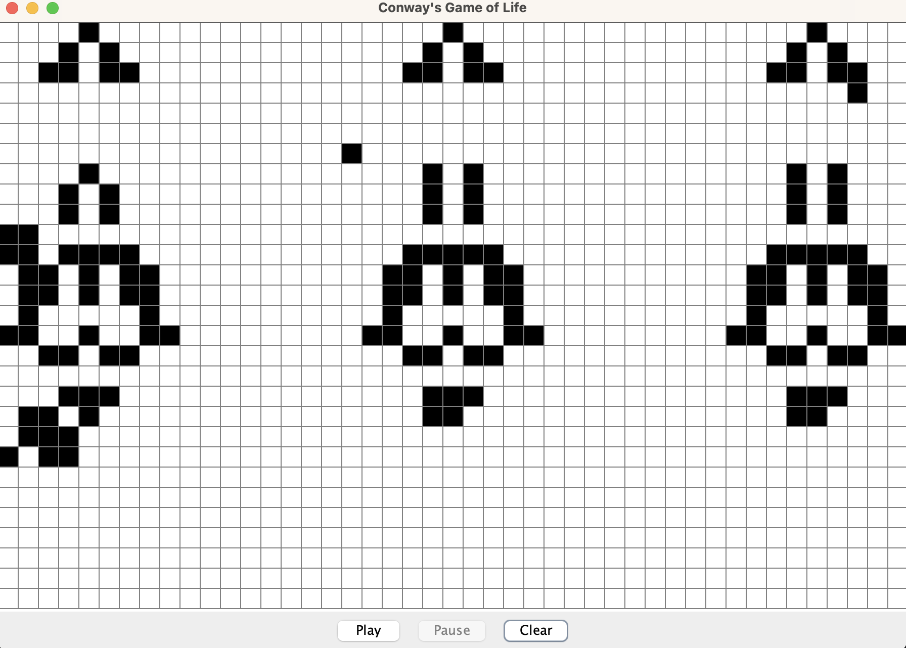

# John Conway's Game of Life

This is a simulation of Conway's Game of Life where cells on a grid 
live, die, or are born based on simple rules related to their neighbors.

Additionally, this application parses .rle files and will display the pattern
in the gui.
